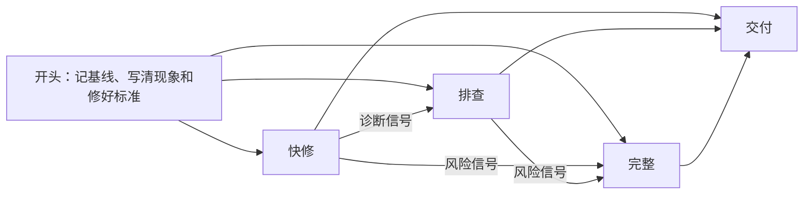

# fixing-bugs

这是一个给 AI 编码助手（下文简称 agent）用的 skill。它按难度分三档修 bug：先走能用的最轻一档，证据不够或风险变大时再升档。简单的问题几步就能修完；原因不明的问题，agent 会先查到根因再修。

它只在你输入 `/fixing-bugs` 时调用，平时不占 agent 的上下文。

---

## 三档

下表每行是一档：什么时候从这一档开始，这一档做什么，最后留下什么记录。

| 档位 | 起始条件 | 做什么 | 留下的记录 |
|---|---|---|---|
| 快修 | 日志或报错直接指向代码，读那段代码就能确认原因 | 写一条修之前会失败的命令（测试或复现脚本），改代码到它通过，再跑相关测试 | 对话里的报告 |
| 排查 | 原因不明 | 按 `diagnosing-bugs` 复现、缩小、列假设、打点，找到根因后先写会失败的回归测试，再修到通过 | 对话里的报告 |
| 完整 | 你说「先别改」或要求留文档 | 写方案文档和测试计划，等你确认方案后，逐条先失败再通过 | `.scratch/bug-<短名>/` 下的两份文档，加对话里的报告 |

快修和排查两档改代码前不等你确认，结束时报告根因、改动和验证输出。只有完整档在改代码前停下，等你确认方案。

排查和完整两档还多两道检查：
1. **交付前审查**：agent 另派一个只读的 subagent，只给它现象、修好标准、根因和改动，不给诊断过程。它查两件事：改动是消除了根因，还是只遮住了症状；回归测试检查的是修好标准，还是照着改后的代码写的。agent 逐条核实，成立的修掉并重跑验证，不成立的在报告里写明理由。宿主不能派 subagent 时跳过，报告里会写明。
2. **改法上限**：同一条回归测试换了 3 种实质不同的改法还不通过，agent 不再试第 4 种，撤回这些改法，回头重新列假设。第二次碰到上限，就停下来问你。

## 升档

agent 每一步都看两类信号，碰到就升档。下图是三档之间怎么走。



**诊断信号**让快修升到排查：
1. 读代码确认不了原因，只能猜。
2. 修之前那条命令不失败，或者失败的样子和症状不一样。
3. 修完那条命令还是失败。
4. 日志指向不止一处，可能不止一个原因。

**风险信号**让快修或排查升到完整。agent 在确认根因后、改代码前检查：
1. 修法有两种以上，且实质不同。
2. 改动涉及对外接口、协议、数据格式、存量数据或迁移。
3. 改动跨多个模块。
4. 你说「先别改」或要求留文档。这一条任何时候出现都算。

档位是 agent 自己选的，碰到信号就直接升，并在对话里说明碰到了哪一条。档位是你指定的，agent 会先停下来问你要不要升。升档时，已经查到的事实、复现命令和打点证据都沿用，不重做。

## 用法

在对话里输入 `/fixing-bugs`，后面写现象，贴上日志。下面三个例子都是假设的场景：

```text
/fixing-bugs 下单接口返回 500，日志如下：<日志>
/fixing-bugs 快修：登录页按钮文字写错了，应该是「登录」
/fixing-bugs 先别改，查一下为什么导出的 CSV 偶尔少一行
```

想指定档位，就在描述里写「快修」「排查」或「完整」。写「先别改」时，agent 走完整档，交出方案文档和测试计划后停下，不改代码。

注意：快修档做不出修之前会失败的命令时（例如纯界面样式），agent 会照样修，但报告里会写明「没有自动验证」，并给出人工验证步骤。

## 长任务续航（可选）

`SKILL.md` 本身不依赖 `/goal`。在支持 `/goal` 的 Cursor 环境里，可以这样启动长时间的修复：

```text
/goal 使用 /fixing-bugs 修复 <问题>，直到原始复现和全部本轮必做测试通过、调试痕迹清理完成，并完成最终增量审查
```

目标里不要只写「直到所有测试通过」。测试范围可能不完整，也可能有和本次修复无关的历史失败。原始症状、必做用例、清理和改动审查都要写进目标。

---

## 安装

### 方式 1：用 skills CLI 安装

```bash
npx skills add Shengjingwa/fixing-bugs
```

### 方式 2：手动复制

把 `skills/fixing-bugs/` 整个目录复制到对应工具的 skill 目录：

- **Cursor**：`~/.cursor/skills/fixing-bugs/`（Windows 是 `%USERPROFILE%\.cursor\skills\fixing-bugs\`）
- **Claude Code**：`~/.claude/skills/fixing-bugs/`
- **Codex**：`~/.codex/skills/fixing-bugs/`

注意：
1. 目录名必须是 `fixing-bugs`，和 `SKILL.md` 里的 `name` 一致。
2. 目录里有 `SKILL.md` 和 `full.md` 两个文件，要一起复制。
3. 在 Cloud Agent 或远程容器里用时，把目录放到仓库根目录下的 `.cursor/skills/fixing-bugs/`。
4. Cursor 和 Claude Code 读 `SKILL.md` 里的 `disable-model-invocation: true`，只在你输入 `/fixing-bugs` 时调用。Codex 用 `agents/openai.yaml` 控制能否自动调用，本仓库没有提供这个文件。

### 从 symptom-to-fix 迁移

这个 skill 原名 `symptom-to-fix`，仓库原名 `Shengjingwa/symptom-to-fix`。旧的 `/symptom-to-fix` 调用不再有效。迁移步骤：

1. 删除旧目录，例如 `~/.cursor/skills/symptom-to-fix/`。
2. 按上面的方式装 `fixing-bugs`。

---

## 前置依赖

排查档和完整档用到两个 skill，都来自 [mattpocock/skills](https://github.com/mattpocock/skills) 的 `skills/engineering/` 目录：

- **`diagnosing-bugs`**：排查档和完整档用它复现问题、找根因。
- **`tdd`**：完整档用它确定测试位置，并按先失败再通过的顺序写测试和修复。

快修档不需要这两个 skill。缺了某一个时，agent 把用到它的步骤标为 `blocked`，写明缺哪个和上游地址，继续做不依赖它的部分。`blocked` 的步骤不算完成。

---

## 许可证

本项目采用 [MIT License](LICENSE) 授权。
