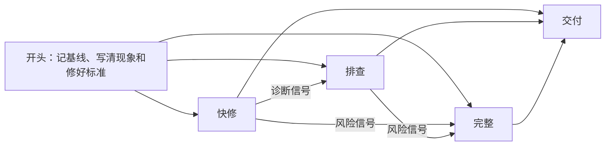
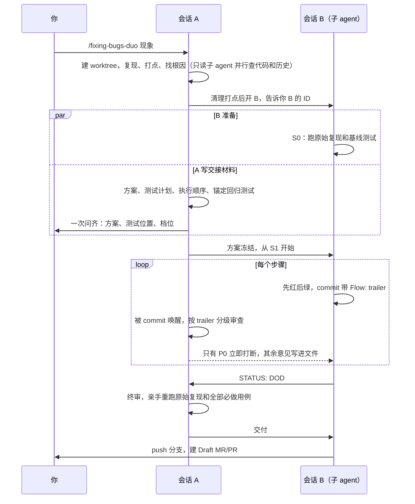

# fixing-bugs

这个仓库有两个给 AI 编码助手（下文简称 agent）用的 skill，都用来修 bug：

| skill | 适合 | 会话 |
|---|---|---|
| `fixing-bugs` | 大多数 bug | 一个会话从诊断做到修复 |
| `fixing-bugs-duo` | 修复要分多步提交、碰到关键路径，或者你想让一个会话专门盯着另一个会话干活 | 会话 A 诊断、写方案、审查；会话 B 在独立的 worktree 里实现 |

两个 skill 都只在你输入对应的 `/` 命令时调用，平时不占 agent 的上下文。拿不准用哪个时，先用 `/fixing-bugs`。它的完整档发现任务过大时，会建议你改用 `/fixing-bugs-duo`。

---

# fixing-bugs（单会话）

它按难度分三档修 bug：先走能用的最轻一档，证据不够或风险变大时再升档。简单的问题几步就能修完；原因不明的问题，agent 会先查到根因再修。

---

## 三档

下表每行是一档：什么时候从这一档开始，这一档做什么，最后留下什么记录。

| 档位 | 起始条件 | 做什么 | 留下的记录 |
|---|---|---|---|
| 快修 | 日志或报错直接指向代码，读那段代码就能确认原因 | 写一条修之前会失败的命令（测试或复现脚本），改代码到它通过，再跑相关测试 | 对话里的报告 |
| 排查 | 原因不明 | 按 `diagnosing-bugs` 复现、缩小、列假设、打点，找到根因后先写会失败的回归测试，再修到通过 | 对话里的报告 |
| 完整 | 你说「先别改」或要求留文档 | 写方案文档和测试计划，等你确认方案后，逐条先失败再通过 | `.scratch/bug-<短名>/` 下的两份文档，加对话里的报告 |

快修和排查两档改代码前不等你确认，结束时报告根因、改动和验证输出。只有完整档在改代码前停下，等你确认方案。

## 升档

agent 每一步都看两类信号，碰到就升档。下图是三档之间怎么走。



**诊断信号**让快修升到排查：
1. 读代码确认不了原因，只能猜。
2. 修之前那条命令不失败，或者失败的样子和症状不一样。
3. 修完那条命令还是失败。
4. 日志指向不止一处，可能不止一个原因。

**风险信号**让快修或排查升到完整。agent 在确认根因后、改代码前检查：
1. 修法有两种以上，且实质不同。
2. 改动涉及对外接口、协议、数据格式、存量数据或迁移。
3. 改动跨多个模块。
4. 你说「先别改」或要求留文档。这一条任何时候出现都算。

档位是 agent 自己选的，碰到信号就直接升，并在对话里说明碰到了哪一条。档位是你指定的，agent 会先停下来问你要不要升。升档时，已经查到的事实、复现命令和打点证据都沿用，不重做。

## 用法

在对话里输入 `/fixing-bugs`，后面写现象，贴上日志。下面三个例子都是假设的场景：

```text
/fixing-bugs 下单接口返回 500，日志如下：<日志>
/fixing-bugs 快修：登录页按钮文字写错了，应该是「登录」
/fixing-bugs 先别改，查一下为什么导出的 CSV 偶尔少一行
```

想指定档位，就在描述里写「快修」「排查」或「完整」。写「先别改」时，agent 走完整档，交出方案文档和测试计划后停下，不改代码。

注意：快修档做不出修之前会失败的命令时（例如纯界面样式），agent 会照样修，但报告里会写明「没有自动验证」，并给出人工验证步骤。

## 长任务续航（可选）

`SKILL.md` 本身不依赖 `/goal`。在支持 `/goal` 的 Cursor 环境里，可以这样启动长时间的修复：

```text
/goal 使用 /fixing-bugs 修复 <问题>，直到原始复现和全部本轮必做测试通过、调试痕迹清理完成，并完成最终增量审查
```

目标里不要只写「直到所有测试通过」。测试范围可能不完整，也可能有和本次修复无关的历史失败。原始症状、必做用例、清理和改动审查都要写进目标。

---

# fixing-bugs-duo（两会话）

你只和会话 A 对话。A 负责诊断根因、写方案和测试计划、审查、验收；它在后台开一个子 agent 作为会话 B，B 在独立的 worktree 里按冻结的方案先写失败的测试，再修到通过。A 盯着 B 的每个 commit 审查，B 遇到歧义向 A 请求裁决。最后 B 建 Draft MR/PR，合入由人确认。

简单问题不开 B：快修档，以及诊断后估算不超过 2 步、没碰关键路径的问题，A 自己单会话修完，报告里写明为什么没开 B。

## 流程

下图是一次两会话修复的主线。A 和 B 共用一个任务 worktree，但不同时写：A 诊断完清干净，才交给 B。



## 分档

诊断出根因后，A 按执行顺序的步数分档：

| 情况 | 做法 |
|---|---|
| 快修档（日志直接指向代码） | 按 `fixing-bugs` 单会话修完，不建 worktree |
| ≤2 步，且没命中硬条件 | 豁免：A 在 worktree 里单会话修完，不开 B |
| 3–8 步，且没命中硬条件 | 轻量版：只在最后一步做一次全量审查 |
| >8 步，或命中硬条件 | 全流程：每个里程碑做一次全量审查，历史上出过事的判据各写一条锚定断言 |

硬条件有三条：需要外部裁决；改动碰到关键路径；改动落在历史上出过 P0/P1 的模块。两档都会锚定第一条正式回归测试：B 只能改它的写法，不能改它的期望值，要改方向必须先向 A 申请。这条规矩防的是最常见的假绿：把回归测试的期望改成迁就现状。

## 现场

| 位置 | 路径 | 谁写 |
|---|---|---|
| 主仓库 | `<父目录>/<repo>` | 不写，只记基线 |
| 任务 worktree | `<父目录>/<repo>-wt-<短名>`，分支 `fix/<短名>` | A 诊断期间归 A，交接后归 B |
| flow 仓库 | `<父目录>/<repo>-flow/`，每个 bug 一个子目录 | 只有 A |

flow 仓库自带 git，放交接材料、裁决记录和审查记录，以及跨任务的登记表 `registry.md`。登记表记关键路径、出过事的模块和门槛判例，下一个 bug 定档时会用到。任务结束后，子目录移进 `archive/`。

## 进度与卡住

A 在对话里每次用一行汇报进度，例如：

```text
[duo csv-missing-row] S2/3 完成 · a1b2c3d · 轻检通过 · 待你拍板：无
```

下面这些事件各汇报一次：B 已开、步骤完成、发现或修好 P0、需要你拍板、B 卡住或出错、最终交付。没有变化时不汇报。你随时问「进度」，A 会先拍一次快照再回答。

A 靠 `scripts/` 里的监视脚本醒来：B 有需要审查的 commit、提出裁决请求、疑似卡住，或者 20 分钟没有任何事件时，脚本都会唤醒 A。判定卡住要三条同时成立：B 本该在干活；它的转录 10 分钟没有新内容；它也没有在跑长命令。这时 A 先自行打断 B 一次。还不恢复，就报给你，由你决定是否换一个 B。

## 用法

```text
/fixing-bugs-duo 每日事件数报表比原始日志少，复现：py -3 -m events.cli data/sample.jsonl
```

前提：
1. 仓库是 git 仓库，能建 worktree，git 版本不低于 2.15（要用 `--no-optional-locks`）。
2. 宿主能开后台子 agent，并能给运行中的子 agent 发消息。Cursor 可以。宿主不支持时，A 把 B 的启动提示词写进文件，请你新开一个聊天粘贴；紧急消息由你转达。
3. 宿主能用后台命令的输出唤醒 agent，例如 Cursor Shell 的 `notify_on_output`。

---

# 安装

`fixing-bugs-duo` 要读同级目录里的 `fixing-bugs`，用 duo 时两个都要装，并放在同一个 skill 目录下。

## 方式 1：用 skills CLI 安装

```bash
npx skills add Shengjingwa/fixing-bugs
```

CLI 会列出仓库里的两个 skill，两个都选上。

## 方式 2：手动复制

把 `skills/` 下的两个目录整个复制到对应工具的 skill 目录：

- **Cursor**：`~/.cursor/skills/`（Windows 是 `%USERPROFILE%\.cursor\skills\`）
- **Claude Code**：`~/.claude/skills/`
- **Codex**：`~/.codex/skills/`

复制完应该是 `<skill 目录>/fixing-bugs/` 和 `<skill 目录>/fixing-bugs-duo/` 并列。

注意：
1. 目录名必须和 `SKILL.md` 里的 `name` 一致，即 `fixing-bugs` 和 `fixing-bugs-duo`。
2. 整个目录一起复制：`fixing-bugs/` 里有 `SKILL.md` 和 `full.md`；`fixing-bugs-duo/` 里有 `SKILL.md`、`b.md`、`review.md`、`files.md` 和 `scripts/`。
3. 在 Cloud Agent 或远程容器里用时，把两个目录放到仓库根目录下的 `.cursor/skills/`。
4. Cursor 和 Claude Code 读 `SKILL.md` 里的 `disable-model-invocation: true`，只在你输入 `/fixing-bugs` 或 `/fixing-bugs-duo` 时调用。Codex 用 `agents/openai.yaml` 控制能否自动调用，本仓库没有提供这个文件。

## 从 symptom-to-fix 迁移

`fixing-bugs` 原名 `symptom-to-fix`，仓库原名 `Shengjingwa/symptom-to-fix`。旧的 `/symptom-to-fix` 调用不再有效。迁移步骤：

1. 删除旧目录，例如 `~/.cursor/skills/symptom-to-fix/`。
2. 按上面的方式装 `fixing-bugs`。

---

# 前置依赖

`fixing-bugs` 的排查档和完整档用到两个 skill，都来自 [mattpocock/skills](https://github.com/mattpocock/skills) 的 `skills/engineering/` 目录：

- **`diagnosing-bugs`**：排查档和完整档用它复现问题、找根因。
- **`tdd`**：完整档用它确定测试位置，并按先失败再通过的顺序写测试和修复。

快修档不需要这两个 skill。缺了某一个时，agent 把用到它的步骤标为 `blocked`，写明缺哪个和上游地址，继续做不依赖它的部分。`blocked` 的步骤不算完成。

`fixing-bugs-duo` 依赖 `fixing-bugs`，以及上面两个 skill：A 诊断时用 `diagnosing-bugs`，B 写测试时用 `tdd`。

---

# 许可证

本项目采用 [MIT License](LICENSE) 授权。
